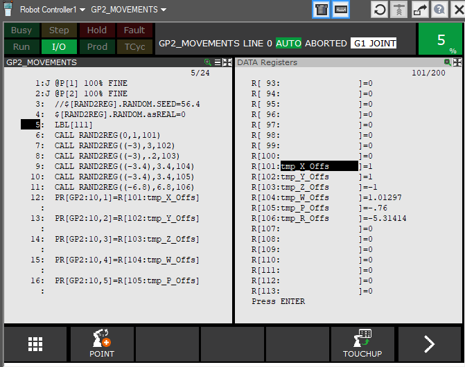

**source file of RAND2REG_Info.html**
# RAND2REG README
Program to set a random value to a numeric register.
Linear Congruence method is used. 
	
    Teach Pendant usage:
	: CALL RAND2REG(MIN;MAX;RegID);
	   MIN: minimum value; REAL or INT
	   MAX: maximum value; REAL or INT
	   RegID:register for random value 
	         (reg type from MIN value)

**FREE for commercial use**

**© Backdate Software GmbH**

---

## Details

At the bottom the program uses this snippet für generating the pseudo random number:
    
    ..
    RANDOM.INCREMENT = 13849;
    RANDOM.MODULUS = 65536;
    RANDOM.MULTIPLIER = 25173;
    RANDOM.seed=$FAST_CLOCK;
    ..

    ROUTINE RAND(SEED:INTEGER;MULTIPLIER:INTEGER;
				INCREMENT:INTEGER;MODULUS:INTEGER): REAL
    BEGIN
        SEED = (SEED * MULTIPLIER + INCREMENT) MOD MODULUS
        RETURN((SEED/65535.0))
    END RAND

At (first time) startup, SEED gets initialized by '$FAST_CLOCK'. (only if "isINIT" is *UNINITIALIZED*; e.g. cold start)

### Return Value Type
The **MIN value type** sets the type of output register!
* Change this behavior by modifying "asREAL" variable to true.

        :!TP-Prog (local vars/parameter);
        :$[RAND2REG]RANDOM.asREAL =1;

### Example:
    :  !TP-Prog;
    :  !AR[1] : MIN Value ;
    :  !AR[2] : MAX Value ;
    :  CALL RAND2REG(10,15,1) ;
    :  PAUSE ;
    :  CALL RAND2REG(10.01,149.67,2) ;
    :  PAUSE ;
    :  CALL RAND2REG(10,149.67,3) ;

### Quality
**You are able to change SEED,INCREMENT,MULTIPLIER**

Just change the karel-vars to your needs.

    :!TP-Prog (local vars/parameter);
    :$[RAND2REG]RANDOM.INCREMENT =...;
    :$[RAND2REG]RANDOM.MULTIPLIER = ...;
    :$[RAND2REG]RANDOM.seed=$FAST_CLOCK;

### Resources 
https://ntci.on.ca/compsci/tik/ch8/8_4.htm

https://coding-engineer.com/2019/10/28/random-number-generator-python/

---
---

THE SOFTWARE IS PROVIDED "AS IS", WITHOUT WARRANTY OF ANY KIND

---
- Fanuc is a registered trademark
---
  (c) Backdate Software GmbH
