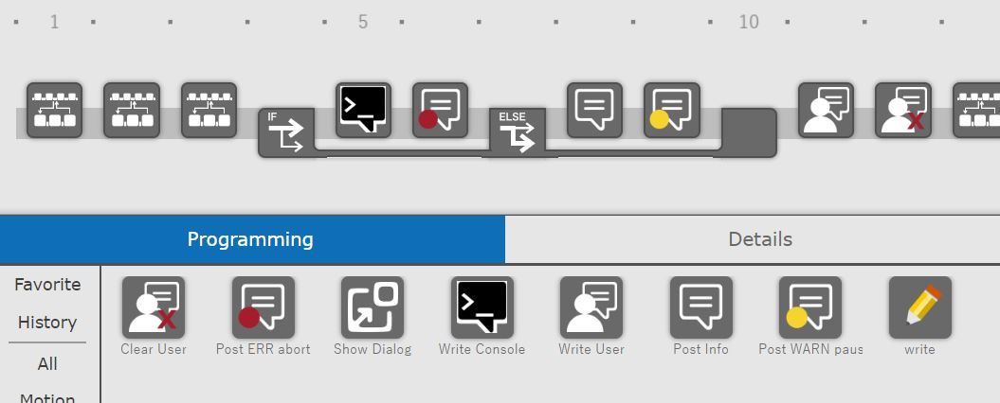

# Changelog
## Changes
- *2023/10/18* : **TP-Tools 1.1.48 release: translations and local Register support ; binary assets**
- *23/09/20* : **TP-Tools 1.1.44 pre release: translations and local Register support**
- *23/09/20* : **TP-Tools 1.0.43 readme/version BUGFIXING/update new features**
- *23/08/31* : **TP-Tools 1.0.42 ADD ord2reg/update readme**
- *23/08/31* : **TP-Tools 1.0.40**
- *23/08/24* : **Release Candidate 1**
- *23/08/24* : **ADD** ping2reg prog
- *23/08/24* : **ADD** New folder **2REG** simple math progs 
- *23/08/23* : **FIX** TP_WRITE: parser timestamp %FAST_CLOCK printing
- *23/08/23* : **ADD/UPDATE** TP_WRITE: parser timestamp %FAST_CLOCK
- *23/08/21* : **FIX** ARGDISP file 
- ... older stuff

### Next steps (planned)
-  prepare translations
-  docs bugfixing

### New features 1.2 (Oct/nov 23)
- just additions, no breaking changes
- CRX Plugin with some functions of TP-Tools. 
    A lot of functions won't fit or are obsolet for CRX/Tablet-TP user.

