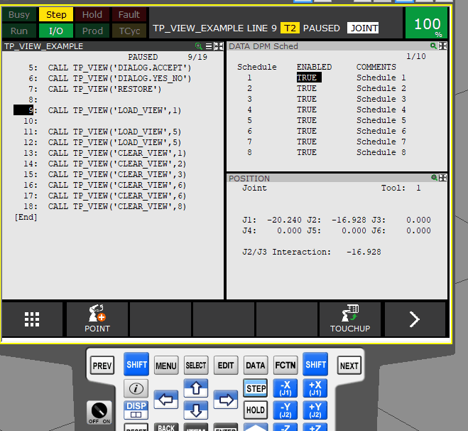

---

# TP-Tools

 Das neueste *Release* finden Sie hier:

 https://github.com/Backdate/TP-Tools/releases

**FREI für kommerzielle Nutzung**

Eine kleine Sammlung von Tools, die die Inbetriebnahme und Programmierung von Fanuc-Robotern vereinfachen.

Die Programme sind lizenziert unter der

*CC BY-ND 4.0 Attribution-NoDerivatives 4.0 International (CC BY-ND 4.0)*


https://creativecommons.org/licenses/by-nd/4.0/.

- Die Weitergabe ist erlaubt.
- Eine Modifikation der Binärdatei ist nicht erlaubt.
- Die Nennung des Urhebers ist gegeben, da die Binärdatei Informationen über den Urheber enthält.

Auch wenn die Creative-Commons-Lizenz nicht für Software gemacht wurde, erfüllt sie hier ihren Zweck.

Eine Lizenzdatei muss NICHT auf die Robotersteuerung kopiert werden.

**Damit steht einer kommerziellen Nutzung nichts im Wege.**

---
### Steuerung und Version

- R-30iA (V7.50)
- R-30iB (V8.10)
- R-30iBPlus (V9.10)
- R-30iBPlus/CRX (V9.40/42)

Wenn es keinen entsprechenden Unterordner gibt, ist die Version (derzeit) nicht verfügbar.

Wenn der *Arg-Wizard* verwendet werden kann oder ein CRX-Plugin vorhanden ist, wird dies beschrieben bzw. erklärt.


## Programmstruktur
Derzeit verwenden die Programme "TP_VIEW" und "TP_WRITE" eine "einheitliche" API.

- Einfache Befehle werden mit einem String aufgerufen oder ausgeführt, der den Befehlsnamen enthält.
  - :CALL TP_VIEW('HELP');
- Bei Befehlen der gleichen Funktionsgruppe wird der Gruppenname durch einen Punkt vom Befehlsnamen getrennt.
  - :CALL TP_VIEW('FORCE.VIEW');
- Befehle können (optionale) Parameter/Argumente haben.
  - :CALL TP_VIEW('FORCE.VIEW',2);

*mehr dazu [DeepDive](/.DeepDive.md)*

---


## TP_VIEW

TP_VIEW kann verwendet werden, um die Fenster/Bildschirme zu wechseln
Sie können umschalten zwischen
- Single / Triple / Dual
- Single_User / Single_User_Wide
- Laden eines benutzerdefinierten Bildschirms
- Modale Dialoge anzeigen


[tp_view](/tp_view/readme.md)



z.B..
```
 :  CALL TP_VIEW('SCREEN.TRIPLE') ;
 :  CALL TP_VIEW('DIALOG.YES_NO',123) ;
 :  AUFRUF VON TP_VIEW('LOAD_VIEW',3) ;
 :  CALL TP_VIEW('CLEAR_VIEW',1) ;
```

**Ein CRX_PlugIn namens *Tablet-TP-Tools* befindet sich in der Entwicklung.**

---
# TP_WRITE

TP_WRITE kann verwendet werden, um einzeilige (dynamische) Nachrichten auf verschiedene "Bildschirme" zu schreiben.

[tp_write](/tp_write/readme.md)


Unter anderem stehen folgende zur Auswahl:

  - Konsole
  - BenutzerBildschirm
  - TPError

Der Arg-Wizard ist implementiert.


**Ein CRX_PlugIn namens *Tablet-TP-Tools* ist in Entwicklung.**

---


## 2REG
Ein Ordner mit einfachen "Nur-Ein-Befehl"-Programmen.
Das Ergebnis wird in das angegebene Register geschrieben

- **sin2REG** --> Sinus in Register
  - z.B. : CALL SIN2REG(33.5,1) ;
- **cos2REG** --> Cosinus in Register
  - z.B. : CALL COS2REG(33.5,2) ;
- **atan22REG** --> atan2 in Register
  - z.B. : CALL ATAN22REG((-100),100,3) ;
- **sqrt2REG** --> Quadratwurzel in Register
  - z.B. : CALL SQRT2REG(33.5,4) ;
- **rand2reg** --> Zufallswert in Register
  - z.B. : CALL rand2reg(33.5,100,4,45) ;
  - siehe Unterordner für Infos
- **ping2reg** --> pinge einen Host/IP an und schreibe das Ergebnis in Register
  - z.B. : CALL ping2reg('192.168.1.1',1) ;
  - benötigte Option: User Socket Msg (R648)
    - Fehler INTP-320 Undefined builtin if not installed
  - Ergebniswert 1 : erfolgreicher Ping
  - Ergebniswert 0 : kein erfolgreicher Ping
- **ord2reg** --> numerischer ASCII-Code aus gegebenem Buchstaben in Register
  - z.B. : CALL ord2reg('ABCDE123,2,1) ;
  - schreibt 66 in Register 1, da der zweite(2) Buchstabe des Strings 'B' ist
  - ... und mehr...


[2REG](2reg/readme.md)


### RAND2REG

 
Erzeugt eine (Pseudo-)Zufallszahl und schreibt den Wert in das entsprechende Register.

Verwendet $FAST_CLOCK zum Initialisieren, kann aber auch konfiguriert werden.


[RAND2REG](2reg/rand2reg/readme.md)


---

## set_invisib

Programme vorübergehend unsichtbar machen oder ausblenden

 [set_invisib](./set_invisib/readme.md)


---
---
## F.A.Q.

- Warum xy? --> faq.md 
- Ich brauche mehr technische Informationen. --> DeepDive.md 
- Wo kann ich ein Changelog finden? Benutze github und schaue in changelog.md.

---

- Fanuc ist ein eingetragenes Warenzeichen. 

---

Copyright (c) 2023 Backdate Software/Andreas Wissing

---