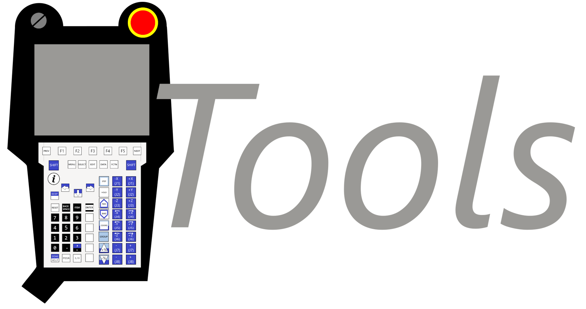
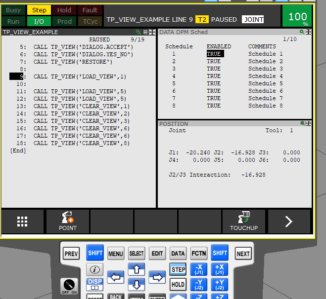
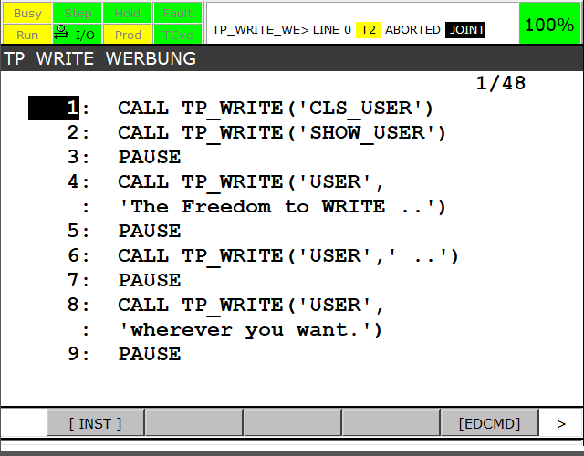
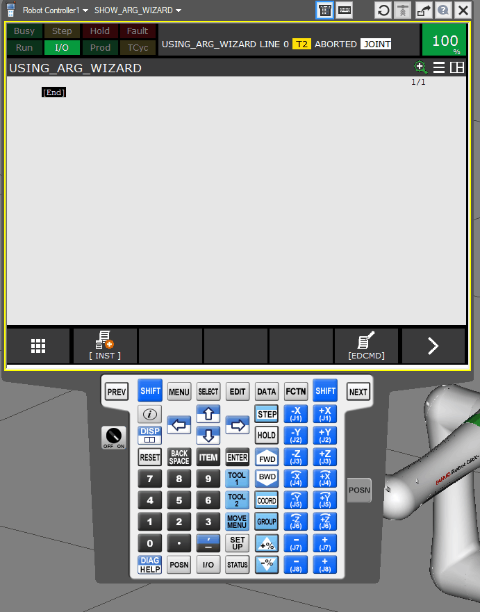
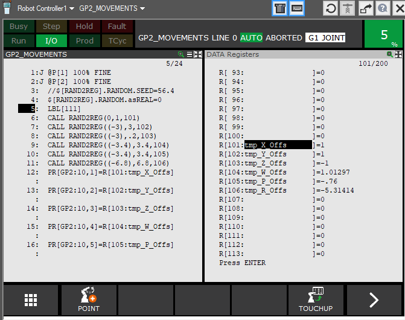

**Please inform us of any oddities with the texts. We are not native english speakers** 

---

[click here for german readme](readme.de.md)

---
---
# TP-Tools

 check the latest *release* here:

 https://github.com/Backdate/TP-Tools/releases

**FREE for commercial use**

A small collection of tools that simplify the commissioning and programming of Fanuc robots.

The programs are licensed under the

*CC BY-ND 4.0 Attribution-NoDerivatives 4.0 International (CC BY-ND 4.0)*


https://creativecommons.org/licenses/by-nd/4.0/

- The distribution is allowed.
- Modification of the binary file is not allowed.
- The naming of the author is given, because the binary file contains information

Even if the Creative Commons license was not made for software, it serves its purpose for us here.

A license file does NOT have to be copied to the robot controller.

**Thereby nothing stands in the way of commercial use.**

---
### Controller and Version

- R-30iA (V7.50)
- R-30iB (V8.10)
- R-30iBPlus (V9.10)
- R-30iBPlus/CRX (V9.40/42)

If there is no corresponding subfolder, the version is (currently) not available.

If the *Arg-Wizard* can be used or there is a CRX plug-in this is described or explained.


## Program structure
Currently the programs "TP_VIEW" and "TP_WRITE" uses a "uniform" API.

- Simple commands are called or executed with a string containing the command name.
  - :CALL TP_VIEW('HELP');
- Commands of same functional group have the  group name separated by a dot from the command name.
  - :CALL TP_VIEW('FORCE.VIEW');
- Commands may have (optional) parameters/arguments.
  - :CALL TP_VIEW('FORCE.VIEW',2);

*more about this  [deepdive](/.DeepDive.md)*

---
## TP_VIEW

TP_VIEW can be used to switch the windows/screens
You can switch between
- Single / Triple / Dual
- Single_User / Single_User_Wide
- Load a user-defined screen
- Show modal Dialogs


[tp_view](/tp_view/readme.md)



e.g.
```
 :  CALL TP_VIEW('SCREEN.TRIPLE') ;
 :  CALL TP_VIEW('DIALOG.YES_NO',123) ;
 :  CALL TP_VIEW('LOAD_VIEW',3) ;
 :  CALL TP_VIEW('CLEAR_VIEW',1) ;
```

**A CRX_PlugIn called *Tablet-TP-Tools* is under development.**

---
## TP_WRITE

TP_WRITE can be used to write single-line (dynamic) messages to various "screens".

[tp_write](/tp_write/readme.md)



Among others, the following are available for selection:

  - Console
  - UserScreen
  - TPError

The Arg-Wizard is implemented.



**A CRX_PlugIn called *Tablet-TP-Tools* is under development.**

---


## 2REG
A folder with simple "one command" progs.
Result is written to specified register

- **sin2REG** --> sine to register
  - e.g. :  CALL SIN2REG(33.5,1) ;
- **cos2REG** --> cosine to register
  - e.g. :  CALL COS2REG(33.5,2) ;
- **atan22REG** --> atan2 to register
  - e.g. :  CALL ATAN22REG((-100),100,3) ;
- **sqrt2REG** --> square root to register
  - e.g. :  CALL SQRT2REG(33.5,4) ;
- **rand2reg** --> random to register
  - e.g. :  CALL rand2reg(33.5,100,4,45) ;
  -  check subfolder for info
- **ping2reg** --> ping a host/IP and write result to reg
  - e.g. :  CALL ping2reg('192.168.1.1',1) ;
  - needed option: User Socket Msg (R648)
    - Error INTP-320 Undefined builtin if not installed
  - Result value 1 : successfull ping
  - Result value 0 : no successfull ping
- **ord2reg** --> numeric ASCII code from given CHAR to register
  - e.g. :  CALL ord2reg('ABCDE123,2,1) ;
  -  will write 66 to register 1, because second(2) Char of string is 'B'

[2REG](2reg/readme.md)


### RAND2REG

 
Generates a (pseudo) random number and writes the value into the corresponding register.

Uses $FAST_CLOCK to initialize, but can also be configured.


[RAND2REG](2reg/rand2reg/readme.md)




---

## set_invisib

Make programs temporarily invisible or hide them

 [set_invisib](./set_invisib/readme.md)


---
---
## F.A.Q.

- Why xy ? --> Check  faq.md
- I need more technical information. --> Check  DeepDive.md
- Where can I find a changelog? Use github and check changelog.md.

---

- Fanuc is a registered trademark. 

---

Copyright (c) 2023 Backdate Software/Andreas Wissing

---


