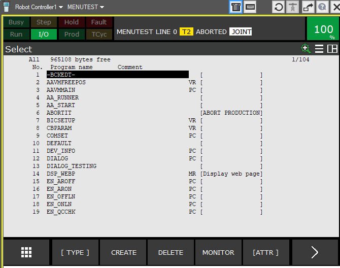

**source file of set_invisib_Info.html**
# set_invisib  README

Set a program or va file visible or invisible.

    : CALL SET_INVISIB('DIALOG_TESTING' ,1);

Call the prog from web browser for best user experience.

    _hostname_/karel/set_invisib  //  127.0.0.1/karel/set_invisib 

**FREE for commercial use**

**© Backdate Software GmbH**

---

## Details

This is a powerfull program.

Keep in mind that the attribut **'invisible'** will be permanetly changed at TP programs!

This might refuse programmers and or users!

Make a 'backup list' of your progs with this tool first! (please check the animation)

---
---

THE SOFTWARE IS PROVIDED "AS IS", WITHOUT WARRANTY OF ANY KIND

---
- Fanuc is a registered trademark
---
  (c) Backdate Software GmbH
